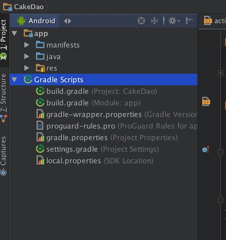
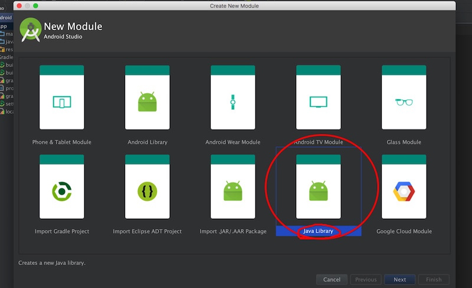
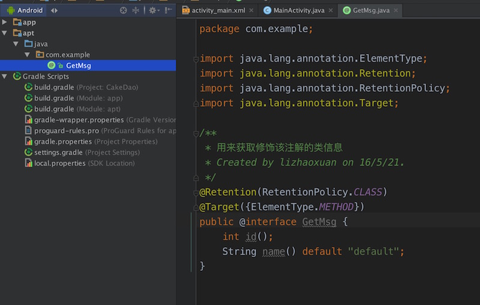
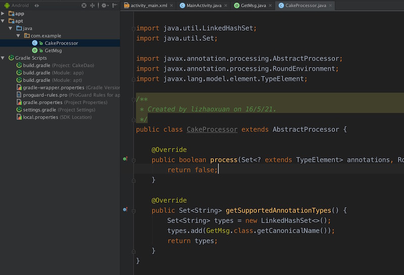
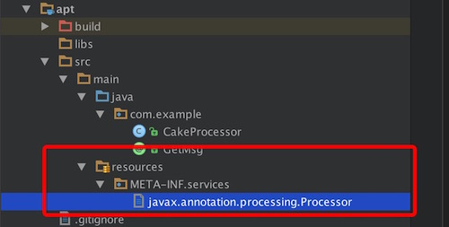
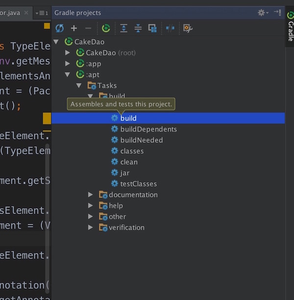
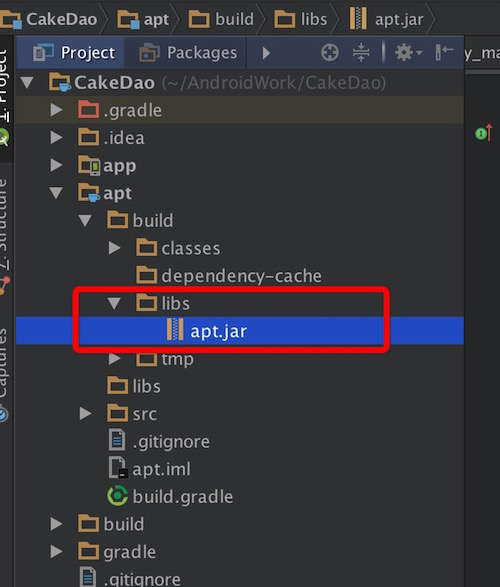
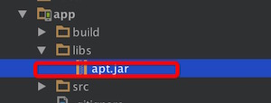
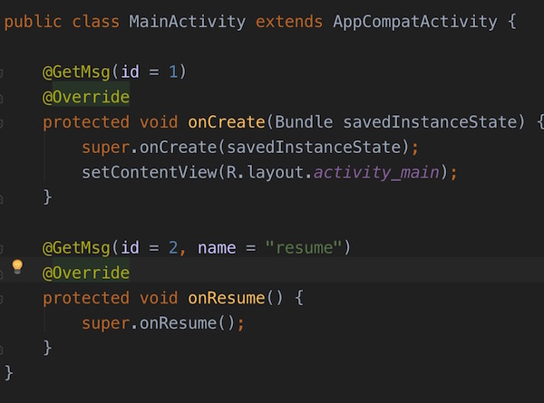

##Android编译时注解框架-Run Demo

 

[《Android编译时注解框架-什么是编译时注解》](https://github.com/lizhaoxuan/Android-APT-Framework/blob/master/什么是编译时注解/android编译时注解框架-什么是编译时注解.md)

《Android编译时注解框架-Run Demo》

[《Android编译时注解框架-Run Project：OnceClick》](https://github.com/lizhaoxuan/Android-APT-Framework/blob/master/run-project/android编译时注解框架-run_project.md)

[《Android编译时注解框架-爬坑》](https://github.com/lizhaoxuan/Android-APT-Framework/blob/master/爬坑/android编译时注解框架-爬坑.md)

[《Android编译时注解框架-语法讲解》](https://github.com/lizhaoxuan/Android-APT-Framework/blob/master/语法讲解/android编译时注解框架-语法讲解.md)

[《Android编译时注解框架-数据库ORM框架CakeDao》](https://github.com/lizhaoxuan/Android-APT-Framework/blob/master/CakeDao/android编译时注解框架-数据库orm框架cakedao.md)

[《Android编译时注解框架-APP更新回滚框架CakeRun》](https://github.com/lizhaoxuan/Android-APT-Framework/blob/master/CakeRun/android编译时注解框架-hold_bug框架cakerun.md)

==============

###1.概述

先讲一下编写《Android编译时注解框架》的初衷吧，APT其实并不难，可以说是简单且高效，但关于APT的资料却并不多，甚至很多人都不知道这么一个技术。国内关于APT的博客屈指可数，唯二找到的几篇初级讲解一个是用Eclipse写得，一个是用AndroidStudio加Intellij。刚开始着实踩了不少坑，但事实是，APT完全可以用AndroidStudio单独实现。光是项目搭建就如此麻烦了，更别提语法讲解了。资料匮乏无疑提高了APT的入门门槛。

正因为如此，这个系列博客就这样诞生啦~现在就教你用AndroidStudio一步步打造自己的APT框架。

以我自己的学习习惯来讲，比起前期大量枯燥的基础知识积累，我更喜欢先把项目跑起来再说，虽然会不明所以，但反而会促进学习兴趣，并且在有结果的场景下一步步深入。

所以作为《Android编译时注解框架》系列的第二篇，我们不管三七二十一，先把APT跑起来再说，看看这到底是个什么东西。跑起来，就入门啦！

**在Running的过程中，有很多语法，我们都暂时一并跳过，都放到《Android编译时注解框架-语法讲解》统一讲。**

###2.Running

#####2.1 项目搭建

首先创建一个Android项目

然后给我们的项目增加一个module,一定要记得是Java Library.

因为APT需要用到jdk下的 【 *javax.~ *】包下的类，这在AndroidSdk中是没有的。

#####2.2 自定义注解

新建一个类，GetMsg。就是我们自定义的注解。

这是一个编译时注解，用*@Retention(RetentionPolicy.CLASS)*修饰。

这个注解只能修饰方法。用*@Target(ElementType.METHOD)*修饰。

且这个注解可以设置两个值。id和name。name是有默认值的，可以不设置。 

#####2.3 创建Processor

Processor是用来处理Annotation的类。继承自AbstractProcessor。

复写AbstractProcessor两个最重要的方法。

*process*方法是用来处理注解的，我们一会写。

*getSupportedAnnotationTypes*用来表示该Processor处理哪些注解。这里我们只有一个*GetMsg*注解需要处理。

#####2.4 重写process方法

我们的目的呢，是获取修饰了GetMsg注解的方法所有信息，只有获得了这些信息，才有依据生成代码不是吗?

    @Override
    public boolean process(Set<? extends TypeElement> annotations, RoundEnvironment env) {
        Messager messager = processingEnv.getMessager();
        for (Element element : env.getElementsAnnotatedWith(GetMsg.class)) {
            PackageElement packageElement = (PackageElement) element
                    .getEnclosingElement();
            //获取该注解所在类的包名
            String packageName = packageElement.getQualifiedName().toString();
            TypeElement classElement = (TypeElement) element;
            //获取该注解所在类的类名
            String className = classElement.getSimpleName().toString();
            //获取该注解所在类的全类名
            String fullClassName = classElement.getQualifiedName().toString();
            VariableElement variableElement = (VariableElement) element.getEnclosingElement();
            //获取方法名
            String methodName = variableElement.getSimpleName().toString();
            //获取该注解的值
            int id = classElement.getAnnotation(GetMsg.class).id();
            String name = classElement.getAnnotation(GetMsg.class).name();
            messager.printMessage(Diagnostic.Kind.NOTE,
                    "Annotation class : packageName = " + packageName);
            messager.printMessage(Diagnostic.Kind.NOTE,
                    "Annotation class : className = " + className);
            messager.printMessage(Diagnostic.Kind.NOTE,
                    "Annotation class : fullClassName = " + fullClassName);
            messager.printMessage(Diagnostic.Kind.NOTE,
                    "Annotation class : methodName = " + methodName);
            messager.printMessage(Diagnostic.Kind.NOTE,
                    "Annotation class : id = " + id + "  name = " + name);
        }
        return true;
    }

简单介绍一下代码：

1.Messager 用来输出。就像我们平时用的System.out.pringln()和Log.d。输出位置在编译器下方的Messages窗口。这里System.out也是可以用的哦~

2.用for循环遍历所有的 GetMsg注解，然后进行处理。

3.Diagnostic.Kind.NOTE 类似于Log.d Log.e这样的等级。

4.return true;表示该Process依据处理了，其他的Process不需要再处理了。

#####2.5 配置

一定不能忘记的文件配置。

在main文件夹下创建一个resources.META-INF.services文件夹，创建文件

javax.annotation.processing.Processor

文件内容是Process类的包名+类名

忘记这个配置文件的后果就是，注解无法生效。

#####2.6 编译jar

这里有一个坑，我们的主Module是不可以直接引用这个java Module的。（直接引用，可以成功运行一次~修改代码以后就不能运行了）

而如何单独编译这个java Module呢？

在编译器Gradle视图里，找到Module apt下的build目录下的Build按钮。双击运行。

代码没有问题编译通过的话，会有BUILD SUCCESS提示

生成的jar包在 apt 下的build目录下的libs下

将apt.jar拷贝到app下的libs目录，右键该jar，点击Add as Library，添加Library.

在APP项目中使用该注解GetMsg。运行。

**当你apt这个包的代码有修改时，需要重复2.6这个步骤。这是比较烦的，但是没办法**

#####2.7 运行结果

###3.总结

这个Demo只是使用了注解，并且根据注解得到一些必要的信息。没有做代码生成的操作，生成代码的具体操作我们放到后面开始写框架时再讲。

整个项目跑起来，遇到了比较多的坑，我们在下一章讲《Android编译时注解框架-爬坑》

这个Demo的代码我放到了GitHub:

[https://github.com/lizhaoxuan/Android-APT-Framework/tree/master/run-demo/CakeDao](https://github.com/lizhaoxuan/Android-APT-Framework/tree/master/run-demo/CakeDao)

