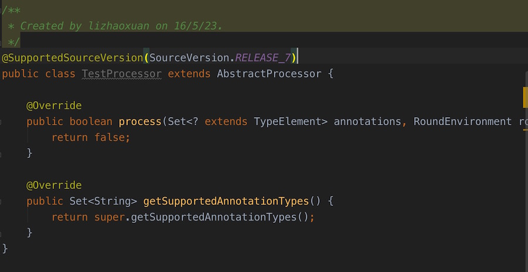
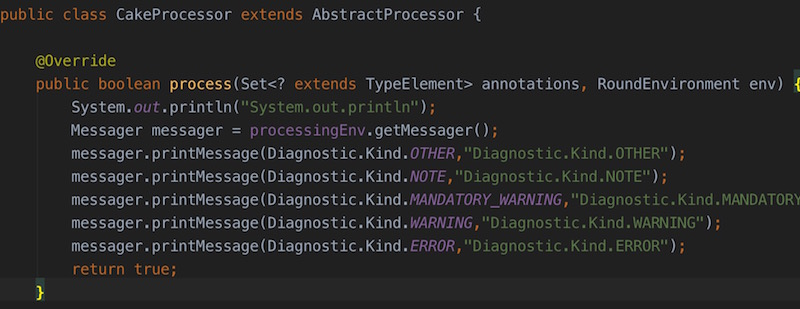
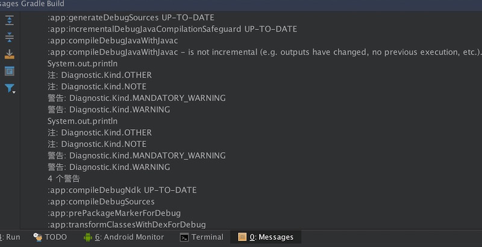

##Android编译时注解框架-语法讲解

 

《Android编译时注解框架-什么是编译时注解》

《Android编译时注解框架-Run Demo》

《Android编译时注解框架-Run Project：OnceClick》

《Android编译时注解框架-爬坑》

《Android编译时注解框架-语法讲解》

《Android编译时注解框架-数据库ORM框架CakeDao》

《Android编译时注解框架-APP更新回滚框架CakeRun》

《Android编译时注解框架-事件分发框架CakeBus》

《Android编译时注解框架-View绑定框架CakeKnife》

==============

###1.概述

本章内容主要对APT一些语法进行简单讲解。apt的学习资料真的太少了，我的学习方法基本上只能通过看开源库的源码猜、看源码注释猜、自己运行着猜……

这里对猜对的结果进行一个总结，让后来者可以更快的上手。

第一次写这种类型的博客，总结的可能有些分散，建议结合开源库源码学习。

###2.自定义注解相关

定义注解格式：   public @interface 注解名 {定义体}

Annotation里面的参数该设定: 

第一,只能用public或默认(default)这两个访问权修饰.例如,String value();这里把方法设为defaul默认类型；　 　

第二,参数成员只能用基本类型byte,short,char,int,long,float,double,boolean八种基本数据类型和 String,Enum,Class,annotations等数据类型,以及这一些类型的数组.例如,String value();这里的参数成员就为String;　　

	@Retention(RetentionPolicy.CLASS)
	@Target(ElementType.TYPE)
	public @interface GetMsg {
	    int id();  //注解参数
	    String name() default "default";
	}
	
	//使用
	@GetMsg(id = 1,name = "asd")
	class Test{
	}
	
如果只有一个参数，建议设置为value

	@Retention(RetentionPolicy.CLASS)
	@Target(ElementType.TYPE)
	public @interface Println {
	    int value();
	}
	
	//使用
	@Println(1)
	class Test{
	}
	
参数为value时，可以直接写入参数。

	
#####2.1 @Retention

这个在第一章有讲。申明该注解属于什么类型注解

- @Retention(RetentionPolicy.SOURCE)

	源码时注解，一般用来作为编译器标记。就比如Override, Deprecated, SuppressWarnings这样的注解。（这个我们一般都很少自定义的）
	
- @Retention(RetentionPolicy.RUNTIME)

	运行时注解，一般在运行时通过反射去识别的注解。

- @Retention(RetentionPolicy.CLASS)

	编译时注解，在编译时处理。
	
#####2.2 @Target(ElementType.TYPE)

表示该注解用来修饰哪些元素。并可以修饰多个

	@Retention(RetentionPolicy.CLASS)
	@Target({ElementType.LOCAL_VARIABLE,ElementType.METHOD})
	public @interface GetMsg {
	    int id();
	    String name() default "default";
	}

例如 GetMsg只能用在局部变量和方法上，如果修饰到类上编译器会报错。

	@GetMsg(1)
    public void printError(){
        //TODO ~
    }
    
    @GetMsg(1)  //编译器会报错
    class Test{
     	//TODO ~
    }
    
- @Target(ElementType.TYPE)

	接口、类、枚举、注解
	
- @Target(ElementType.FIELD) 

	字段、枚举的常量
	
- @Target(ElementType.METHOD) 

	方法
	
- @Target(ElementType.PARAMETER)
	
	方法参数 
	
- @Target(ElementType.CONSTRUCTOR) 

	构造函数 

- @Target(ElementType.LOCAL_VARIABLE)

	局部变量 

- @Target(ElementType.ANNOTATION_TYPE)

	注解 
	
- @Target(ElementType.package) 

	包 
	

#####2.3 注解的默认值

注解可以设置默认值，有默认值的参数可以不写。

	@Retention(RetentionPolicy.CLASS)
	@Target(ElementType.TYPE)
	public @interface GetMsg {
	    int id();  //注解参数
	    String name() default "default";
	}
	
	//使用
	@GetMsg(id = 1) //name有默认值可以不写
	class Test{
	}

#####2.4 “注解的继承”（依赖倒置？）

这里讲的继承并不是通过@Inherited修饰的注解。（@Inherited这个元注解我研究了好久好像对编译时注解没什么用）

这个“继承”是一个注解的使用技巧，使用上的感觉类似于依赖倒置，来自于ButterKnife源码。

先看代码。

	@Target(METHOD)
	@Retention(CLASS)
	@ListenerClass(
	    targetType = "android.view.View",
    	setter = "setOnClickListener",
    	type = "butterknife.internal.DebouncingOnClickListener",
    	method = @ListenerMethod(
        	name = "doClick",
        	parameters = "android.view.View"
    	)
	)
	public @interface OnClick {
  		/** View IDs to which the method will be bound. */
  		int[] value() default { View.NO_ID };
	}
	

这是ButterKnife的OnClick 注解。特殊的地方在于**@OnClick修饰了注解@ListenerClass**，并且设置了一些只属于@OnClick的属性。

那这样的作用是什么呢？

凡是修饰了@OnClick的地方，也就自动修饰了@ListenerClass。类似于@OnClick是@ListenerClass的子类。而ButterKnife有很多的监听注解@OnItemClick、@OnLongClick等等。

这样在做代码生成时，不需要再单独考虑每一个监听注解，只需要处理@ListenerClass就OK。

###3.处理器类Processor编写

自定义注解后，需要编写Processor类处理注解。Processor继承自AbstractProcessor的类。

AbstractProcessor有两个重要的方法需要重写。

#####3.1重写getSupportedAnnotationTypes方法：

通过重写该方法，告知Processor哪些注解需要处理。

返回一个Set集合，集合内容为自定义注解的包名+类名。

建议项目中这样编写：

	@Override
    public Set<String> getSupportedAnnotationTypes() {
        Set<String> types = new LinkedHashSet<>();
        //需要全类名
        types.add(GetMsg.class.getCanonicalName()); 
        types.add(Println.class.getCanonicalName());
        return types;
    }
    
另外如果注解数量很少的话，可以通过另一种方式实现：

	//在只有一到两个注解需要处理时，可以这样编写：
	@SupportedAnnotationTypes("com.example.annotation.SetContentView")
	@SupportedSourceVersion(SourceVersion.RELEASE_7)
	public class ContentViewProcessor extends AbstractProcessor {
	
	}
	
#####3.2重写process方法：

所有的注解处理都是从这个方法开始的，你可以理解为，当APT找到所有需要处理的注解后，会回调这个方法，你可以通过这个方法的参数，拿到你所需要的信息。

	@Override
    public boolean process(Set<? extends TypeElement> annotations, RoundEnvironment roundEnv) {
        
        
        return false;
    }

先简单解释下这个方法的参数和返回值。

**参数** *Set<? extends TypeElement> annotations* ：将返回所有的由该Processor处理，并待处理的 Annotations。（属于该Processor处理的注解，但并未被使用，不存在与这个集合里）
**参数** *RoundEnvironment roundEnv* ：表示当前或是之前的运行环境，可以通过该对象查找找到的注解。

例：		

	for (Element element : env.getElementsAnnotatedWith(GetMsg.class)) {
		//所有被使用的@GetMsg
	}

**返回值** 表示这组 annotations 是否被这个 Processor 接受，如果接受（true）后续子的 pocessor 不会再对这个 Annotations 进行处理

###4.输出Log

虽然是编译时执行Processor,但也是可以输入日志信息用于调试的。

**Processor日志输出的位置在编译器下方的Messages窗口中。**

Processor支持最基础的System.out方法。

同样Processor也有自己的Log输出工具: Messager。

	@Override
    public boolean process(Set<? extends TypeElement> annotations, RoundEnvironment env) {
    	
    	//取得Messager对象
        Messager messager = processingEnv.getMessager();
        
        //输出日志
        messager.printMessage(Diagnostic.Kind.NOTE,
                    "Annotation class : className = " + element.getSimpleName().toString());
        }

同Log类似，Messager也有日志级别的选择。

- Diagnostic.Kind.ERROR 
- Diagnostic.Kind.WARNING 
- Diagnostic.Kind.MANDATORY_WARNING 
- Diagnostic.Kind.NOTE 
- Diagnostic.Kind.OTHER 

他们的输出样式如图：

(原谅我也不清楚为什么会输出两次，只是输出annotations size来看，第一次annotations是有值的，第二次annotations size变成了0)

#####注意：当没有属于该Process处理的注解被使用时，process不会执行。

#####注意：如果发现替换jar后，apt代码并没有执行，尝试clean项目。

###4.Element

Element也是APT的重点之一，所有通过注解取得元素都将以Element类型等待处理，也可以理解为Element的子类类型与自定义注解时用到的@Target是有对应关系的。

Element的官方注释：

Represents a program element such as a package, class, or method.
Each element represents a static, language-level construct (and not, for example, a runtime construct of the virtual machine).

表示一个程序元素，比如包、类或者方法。

例如：取得所有修饰了@OnceClick的元素。
	
	for (Element element : roundEnv.getElementsAnnotatedWith(OnceClick.class)){
		//OnceClick.class是@Target(METHOD)
		//则该element是可以强转为表示方法的ExecutableElement
		ExecutableElement method = （ExecutableElement）element;
		//如果需要用到其他类型的Element，则不可以直接强转，需要通过下面方法转换
		//但有例外情况，我们稍后列举
		TypeElement classElement = (TypeElement) element
                    .getEnclosingElement();
	}

Element的子类有：

- ExecutableElement
	
	表示某个类或接口的方法、构造方法或初始化程序（静态或实例），包括注释类型元素。
	
	对应@Target(ElementType.METHOD) @Target(ElementType.CONSTRUCTOR)

- PackageElement;

	表示一个包程序元素。提供对有关包极其成员的信息访问。
	
	对应@Target(ElementType.PACKAGE)

- TypeElement;

	表示一个类或接口程序元素。提供对有关类型极其成员的信息访问。
	
	对应@Target(ElementType.TYPE)
	
	**注意：枚举类型是一种类，而注解类型是一种接口。**

- TypeParameterElement;

	表示一般类、接口、方法或构造方法元素的类型参数。
	
	对应@Target(ElementType.PARAMETER)

- VariableElement;

	表示一个字段、enum常量、方法或构造方法参数、局部变量或异常参数。
	
	对应@Target(ElementType.LOCAL_VARIABLE)
	
例如：@OnceClick的@Target(METHOD)。其修饰方法，那么在这个情况下：

Element 可以直接强制转换为ExecutableElement。而其他类型的Element不能直接强制转，需要其他办法。

	for (Element element : roundEnv.getElementsAnnotatedWith(OnceClick.class)){
		ExecutableElement method = (ExecutableElement)element;
	}

接下来我们将以@Target()分类进行讲解，不同Element的信息获取方式不同。

###5.修饰方法的注解和ExecutableElement

当你有一个注解是以@Target(ElementType.METHOD)定义时，表示该注解只能修饰方法。

那么这个时候你为了生成代码，而需要获取一些基本信息：包名、类名、方法名、参数类型、返回值。

如何获取：

	//OnceClick.class 以 @Target(ElementType.METHOD)修饰
	for (Element element : roundEnv.getElementsAnnotatedWith(OnceClick.class)) {
		//对于Element直接强转
        ExecutableElement executableElement = (ExecutableElement) element;
        
        //非对应的Element，通过getEnclosingElement转换获取
        TypeElement classElement = (TypeElement) element
                    .getEnclosingElement();
                    
        //当(ExecutableElement) element成立时，使用(PackageElement) element
        //            .getEnclosingElement();将报错。
        //需要使用elementUtils来获取
        Elements elementUtils = processingEnv.getElementUtils();
        PackageElement packageElement = elementUtils.getPackageOf(classElement);
		
		//全类名
        String fullClassName = classElement.getQualifiedName().toString();
        //类名
        String className = classElement.getSimpleName().toString();
        //包名
        String packageName = packageElement.getQualifiedName().toString();
        //方法名
        String methodName = executableElement.getSimpleName().toString();

		//取得方法参数列表
		List<? extends VariableElement> methodParameters = executableElement.getParameters();
		//参数类型列表
		List<String> types = new ArrayList<>();
        for (VariableElement variableElement : methodParameters) {
            TypeMirror methodParameterType = variableElement.asType();
            if (methodParameterType instanceof TypeVariable) {
                TypeVariable typeVariable = (TypeVariable) methodParameterType;
                methodParameterType = typeVariable.getUpperBound();
                
            }
            //参数名
            String parameterName = variableElement.getSimpleName().toString();
            //参数类型
            String parameteKind = methodParameterType.toString();
            types.add(methodParameterType.toString());
        }
	}

###6.修饰属性、类成员的注解和VariableElement

当你有一个注解是以@Target(ElementType.FIELD)定义时，表示该注解只能修饰属性、类成员。

那么这个时候你为了生成代码，而需要获取一些基本信息：包名、类名、类成员类型、类成员名

如何获取：

	for (Element element : roundEnv.getElementsAnnotatedWith(IdProperty.class)) {
		//ElementType.FIELD注解可以直接强转VariableElement
		VariableElement variableElement = (VariableElement) element;
		
        TypeElement classElement = (TypeElement) element
                .getEnclosingElement();
        PackageElement packageElement = elementUtils.getPackageOf(classElement);
        //类名
        String className = classElement.getSimpleName().toString();
        //包名
        String packageName = packageElement.getQualifiedName().toString();
        //类成员名
        String variableName = variableElement.getSimpleName().toString();
        
        //类成员类型
        TypeMirror typeMirror = variableElement.asType();
        String type = typeMirror.toString();
        
	}
	
	
###7.修饰类的注解和TypeElement

当你有一个注解是以@Target(ElementType.TYPE)定义时，表示该注解只能修饰类、接口、枚举。

那么这个时候你为了生成代码，而需要获取一些基本信息：包名、类名、全类名、父类。

如何获取：

	for (Element element : roundEnv.getElementsAnnotatedWith(xxx.class)) {
		//ElementType.TYPE注解可以直接强转TypeElement
        TypeElement classElement = (TypeElement) element;
        
        PackageElement packageElement = (PackageElement) element
                    .getEnclosingElement();
                    
        //全类名
        String fullClassName = classElement.getQualifiedName().toString();
        //类名
        String className = classElement.getSimpleName().toString();
        //包名
        String packageName = packageElement.getQualifiedName().toString();
 		//父类名
 		String superClassName = classElement.getSuperclass().toString();
        
	}
